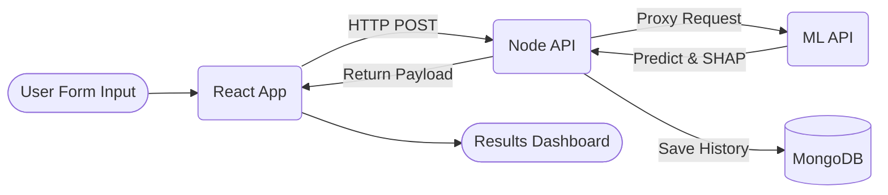
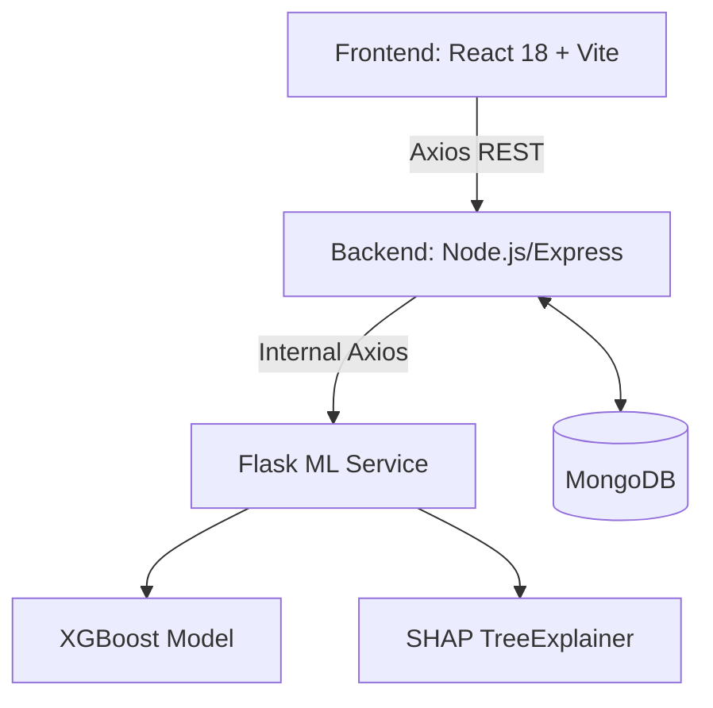
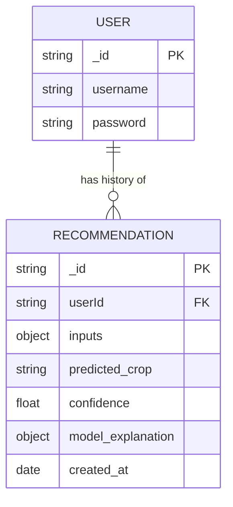
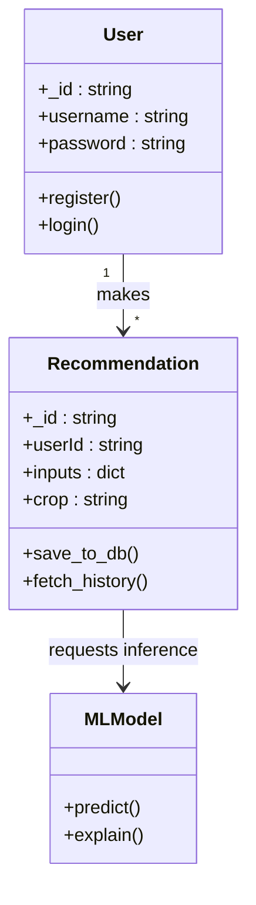

# Software Requirements Specification (SRS) - AGRO.XAI

## 1. Requirement Phase

### 1.1 Abstract
**AGRO.XAI** is an intelligent, farmer-friendly crop recommendation engine powered by XGBoost and SHAP. It provides end-to-end full-stack web capabilities, real-time explainability, and rich agronomic analysis modules. Unlike traditional black-box tools, it explains *why* a crop was chosen, giving farmers and agronomists actionable, trustworthy insights.

### 1.2 Feature Finalization
- **Crop Recommendation**: XGBoost model predicts the best crop based on soil and weather.
- **Explainability (XAI)**: SHAP values highlight the top 3 driving factors.
- **Risk Analysis**: Confidence-based assessment with mitigation steps.
- **Revenue Estimation**: Profit projections based on crop type and area.
- **Soil Improvement**: Soil-specific fertilizer recommendations.
- **Growing Guide**: Month-by-month cultivation calendar.
- **Government Schemes**: Relevant agricultural subsidy schemes fetching.
- **User Authentication**: Secure JWT-based registration and login system with historical tracking.

### 1.3 Functional Requirements
- The system must allow users to register and log in securely.
- Users must be able to input soil constituents (N, P, K, pH) and weather parameters (Temperature, Humidity, Rainfall).
- The system must fetch predictions from the ML model and display the suggested crop.
- The system must display the underlying model decision using visually interpretable SHAP graphs.
- The system must provide modular agronomic reports (Risk, Feasibility, Revenue, Guides) dynamically based on the predicted crop.

### 1.4 Non-Functional Requirements
- **Performance**: ML predictions should return in under 2 seconds.
- **Explainability**: Outputs must be legible to non-technical end-users.
- **Scalability**: The backend Node.js and Flask services must operate asynchronously handling concurrent prediction requests.
- **Security**: Passwords encrypted via bcryptjs, sessions stored via HttpOnly/JWT approaches.

### 1.5 Stakeholders
1. **Farmers**: Primary users seeking advice on what to plant to maximize profit and yield.
2. **Agronomists/Experts**: Professionals using the tool to validate farm-level decisions via the Explainability module.
3. **Agri-Business / Government Agencies**: Entities tracking cultivation patterns and dispersing schemes.

### 1.6 Use Cases for Each Stakeholder
- **Farmer Use Case**: Log in -> Select location / input soil values -> Request recommendation -> View best crop and profit estimation.
- **Agronomist Use Case**: Enter expert values sequentially -> Analyze SHAP output -> Assess structural soil risks based on confidence matrix.
- **Government Use Case**: Map region suitability -> Correlate crops with available regional subsidy schemes via the government module.

### 1.7 Workflow and Data Flow for Use-cases


---

## 2. Design Phase

### 2.1 Solution Design & Architecture
The system employs a microservices-inspired architecture splitting the MERN stack application from the Python ML service. 



### 2.2 Complete Design Specifications
- **Technology Stack**: React, Node.js, Express, MongoDB, Flask, XGBoost, Scikit-learn, Python, TailwindCSS.
- **Mock-up Screens**: 
  - *Home*: Hero section illustrating features.
  - *Predict*: Input fields for NPK, PH, Weather, with toggle handles for "Farmer Mode" and "Expert Mode".
  - *Dashboard*: Master grid with Crop Explanation Panel, Risk Card, Revenue Estimates.

### 2.3 Database Design (DB Diagram)


### 2.4 Class Diagram


---

## 3. Development/Implementation Phase

### 3.1 Coding Considerations
- **Separation of Concerns**: UI components handle display logic; Context API handles data fetching; Backend routers modularized by logic (auth, crop, risk, soil).
- **Environment Handling**: Separated `.env` variables for seamless CI/CD.
- **Security Check**: Validation of incoming requests via middleware, user roles validation.

### 3.2 Pseudo Code (Model API Route)
```text
FUNCTION process_prediction(request):
   inputs = receive(request.body)
   IF validation_fails(inputs):
       RETURN HTTP 400 "Invalid Data"
   mapped_inputs = python_soil_mapper(inputs)
   prediction, confidence = XGBModel.predict(mapped_inputs)
   shap_values = TreeExplainer.explain(mapped_inputs)
   RETURN {crop: prediction, confidence: confidence, explanation: shap_values}
```

### 3.3 Auth & Access Permissions
- **JWT tokens**: Issued upon user registration/login. Required for accessing endpoints such as `/api/history`. 
- **Roles**: Standard users can interact with predictions and history; unauthenticated users can access basic functionality via rate limits.

---

## 4. Testing & Validation Phase

### 4.1 Testing Backend & API Modules
- **Unit Testing**: Testing mathematical transformations in `soil_mapper.py` bounding functions and MongoDB Schema validations.
- **Integration Testing**: Verifying data flows from React `->` Node `->` Flask properly, assessing type mismatches. 
- **Mocking**: External APIs (like location bounding or ML model during frontend unit tests) mocked to prevent bandwidth overflow.

### 4.2 Test Cases Matrix
| Test ID | Module | Scenario | Expected Result | Status |
|---|---|---|---|---|
| TC-01 | Auth | Valid Login | Returns 200 OK + JWT Token | Pass |
| TC-02 | Form | Send missing params to `/api/recommend` | Returns HTTP 400 Bad Request | Pass |
| TC-03 | Model | Feed values leading to `rice` | Predicts `rice` with > 95% conf. | Pass |
| TC-04 | User | Delete history record not owned | Returns HTTP 403 / 404 | Pass |
| TC-05 | UI | Verify Risk Card colors change | UI correctly adapts to low/high risk | Pass |

### 4.3 UI & Regression Testing
- Cross-browser capability tests ensures the chart implementations (Recharts) format perfectly on Chrome, Firefox, and Safari on mobile orientations. 
- **Regression:** Subsequent logic updates are validated against core ML tests to ensure legacy accuracy holds up during refactoring loops.

---

## 5. Deployment Phase

### 5.1 Deployment on Cloud
- The platform is structurally prepared to be deployed on AWS/Azure/GCP.
- **Frontend** configuration bound for static bucket hosting or PaaS like Vercel/Netlify.
- **Backend & ML API** packaged onto containerized applications (Docker) deploying to EC2 instances/App Services, leveraging reverse proxies.
- Mongoose linked to MongoDB Atlas cloud.

### 5.2 URLs & Video Demos
- **Solution App Link**: *To be updated upon final host provisioning*
- **Solution Demo Video Link**: *To be shared post-testing execution*

---

## 6. Completion

### 6.1 Sign-offs
- Project Application Verified.
- Project Document Structure Finalized.
- **Mentors / Evaluators Signature:** _____________________

---

## 7. API Specification

### 7.1 API Design Pattern
The AGRO.XAI platform implements a RESTful microservices architecture consisting of a Node.js/Express API Gateway pointing to a Python/Flask Internal ML Service. All client-facing endpoints in the API Gateway are secured using **JSON Web Tokens (JWT)**, which are passed via the `Authorization: Bearer <token>` header to maintain stateless authentication across requests.

**Standard HTTP Status Codes:**
| Status Code | Description | Usage in AGRO.XAI |
|---|---|---|
| **200 OK** | Success | Standard response for successful requests (e.g., successful login, valid predictions). |
| **201 Created** | Resource Created | Returned upon successful user registration and history storage. |
| **400 Bad Request** | Client Error | Used when validation fails (e.g., missing soil/weather parameters, invalid login credentials). |
| **401 Unauthorized** | Authentication Error | Returned when a JWT is missing, malformed, or expired. |
| **500 Internal Error**| Server Error | Used for unexpected backend crashes or if the Flask ML service is unreachable. |

### 7.2 Internal ML Service (Flask Service)
**Endpoint:** `POST /predict` (Internal Only)
**Description:** Receives continuous and categorical features from the Express Gateway, transforms them using the label and season encoders, and predicts the ideal crop using the XGBoost model.

**JSON Request Schema:**
```json
{
  "N": 85,
  "P": 42,
  "K": 43,
  "temperature": 24.5,
  "humidity": 65.2,
  "ph": 6.8,
  "rainfall": 150.0,
  "soil_type": "Loamy",
  "season": "Monsoon"
}
```

**JSON Response Schema:**
```json
{
  "crop": "rice",
  "confidence": 0.9412,
  "explanation": {
    "rainfall": 0.8124,
    "humidity": 0.5410,
    "N": -0.1245
  }
}
```

### 7.3 API Gateway (Node.js) Endpoints

#### 7.3.1 Auth Module
- **`POST /api/auth/register`**
  - **Payload:** `{ "username": "user1", "password": "secure123" }`
  - **Action:** Hashes password with bcrypt, stores user in MongoDB, and returns a signed JWT.
- **`POST /api/auth/login`**
  - **Payload:** `{ "username": "user1", "password": "secure123" }`
  - **Action:** Validates credentials. Returns a signed JWT valid for 7 days.

#### 7.3.2 Recommendation Module
- **`POST /api/recommend`**
  - **Headers:** `Authorization: Bearer <token>`
  - **Action Flow:**
    1. **JWT Validation:** The `authMiddleware` intercepts the request, verifies the token signature, and attaches the decoded `userId` to the request object.
    2. **Proxy to Flask:** Sends the validated soil and weather features to the internal Flask `POST /predict` endpoint.
    3. **Database Storage:** Upon receiving the `crop`, `confidence`, and `explanation` from Flask, it merges these with the user inputs and persists a new `Recommendation` document to MongoDB linked to the `userId`.
    4. **Client Response:** Forwards the prediction data back to the React frontend.

#### 7.3.3 History Module
- **`GET /api/history`**
  - **Headers:** `Authorization: Bearer <token>`
  - **Action Flow:** Extracts the `userId` from the verified JWT. Queries the MongoDB `Recommendation` collection for all documents matching that `userId`, sorting them by creation date (descending), ensuring users only retrieve their own private records.

### 7.4 Data Validation & Logic
To ensure system stability, input data undergoes rigorous validation before hitting the XGBoost model:

- **Clamping Mechanics:**
  - **pH Limits:** Clamped strictly between `3.5` and `9.9`. Values outside this range are highly unrealistic for agriculture and would skew the tree-based model.
  - **Rainfall Limits:** Capped at `300mm`.
  - **Validation Middleware:** The Express router utilizes input sanitization. If required fields are entirely missing, the system aborts the request instantly with a `400 Bad Request` rather than producing obscure server errors.

- **CORS (Cross-Origin Resource Sharing):**
  - The Node.js server is configured with a robust CORS policy using the `cors()` middleware. This permits the React frontend (running on `http://localhost:5173` or its deployed equivalent) to communicate securely with the API over the network. It explicitly allows `GET`, `POST`, `DELETE` methods and the `Authorization` headers required for the JWT handshake.

### 7.5 External API Integrations (Weather & Location)
To automate environmental data capture, the system incorporates external free-tier services. These requests construct the automated pipeline for the prediction model.

- **Nominatim (OpenStreetMap) Geocoding API:**
  - **Purpose:** Converts user-provided district/state names or GPS coordinates into standardized geographic metadata.
  - **Usage:** Triggered when a user selects a location. It normalizes the location parameters to ensure the correct geographical scope is targeted.
- **Open-Meteo API:**
  - **Purpose:** Fetches crucial weather data required by the XGBoost model, specifically **Temperature (°C)**, **Relative Humidity (%)**, and **Rainfall (mm)**.
  - **Operation Flow:** Once the location's latitude and longitude are resolved via Nominatim, the system triggers a request to Open-Meteo. This seamless integration automatically populates the required meteorological inputs, eliminating the need for the farmer or agronomist to manually input these complex parameters.
